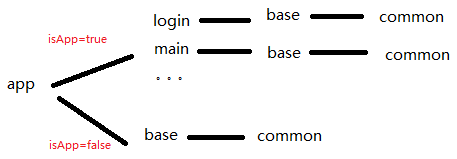

# ZuJian_Demo

组件化的简单实践

- 1.动态切换application与lib模式，我们看上面的代码我们在gradle.properties里面配置
```
if (mineRunAlone.toBoolean()) {
    apply plugin: 'com.android.application'
} else {
    apply plugin: 'com.android.library'
}
```
- 2.组件与组件之间的资源命名冲突，解决方法很简单,添加以下代码就可以了，他代表在项目的名字前添加前缀名
```
 resourcePrefix "login_"
```
- 3.组件与组件之间跳转可以使用ARouter路由

#### 拓展

- 其实最真实的组件结构是这样的：

